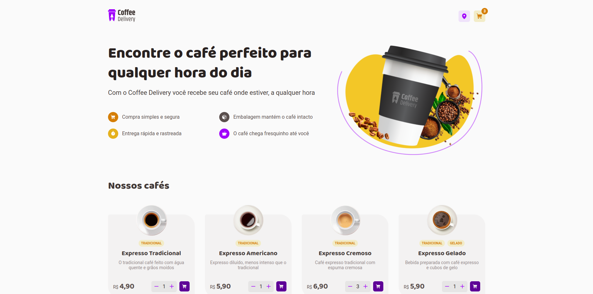
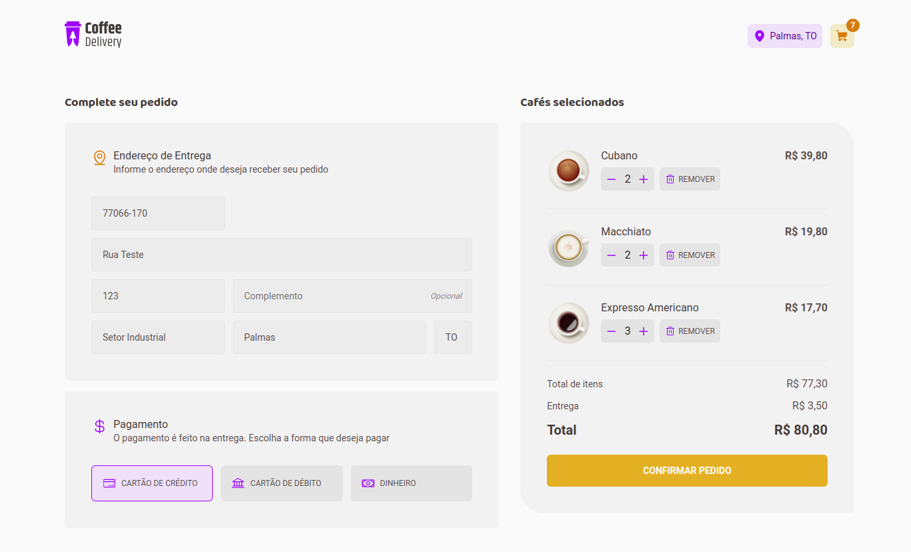
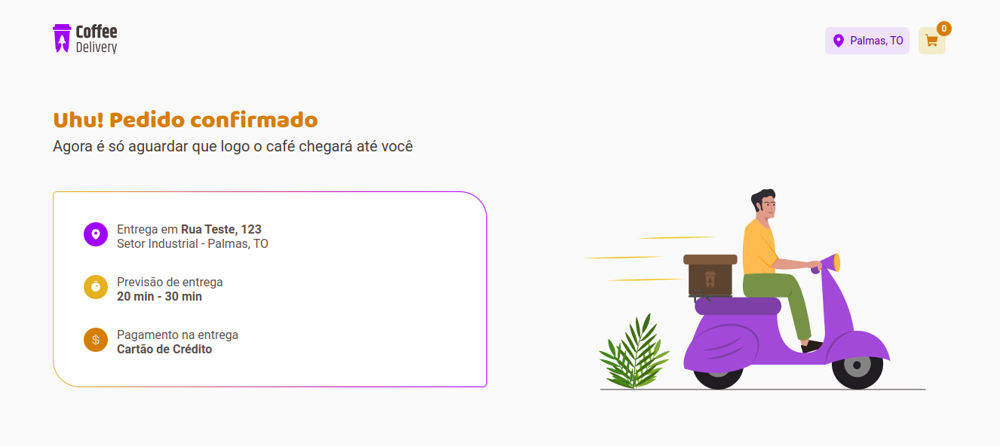

# Coffee Delivery

Projeto desenvolvido durante a formação em React da Rocketseat. Criado com o objetivo de aprimorar habilidades em React e TypeScript, mais precisamente em conhecimentos de ContextAPI, Reducers e LocalStorage. 

Este projeto é um site de delivery de cafés, que oferece funcionalidades completas para gestão de pedidos. Os usuários podem adicionar, editar e remover cafés do carrinho, além de atualizar o endereço de entrega e o método de pagamento. Todos os dados são armazenados no LocalStorage, garantindo que as informações permaneçam intactas, mesmo após o recarregamento do navegador.

## Tecnologias

As seguintes ferramentas foram utilizadas na construção do projeto:


## Screenshot

<div align="center">
    
    
    
</div>

## Como rodar a aplicação

Para o download do projeto, siga as instruções abaixo:

```
1. git clone https://github.com/mateusgs29/todo-list.git
2. cd todo-list
```

Instale as dependências e inicie o projeto:

```
1. npm install
2. npm run dev
```